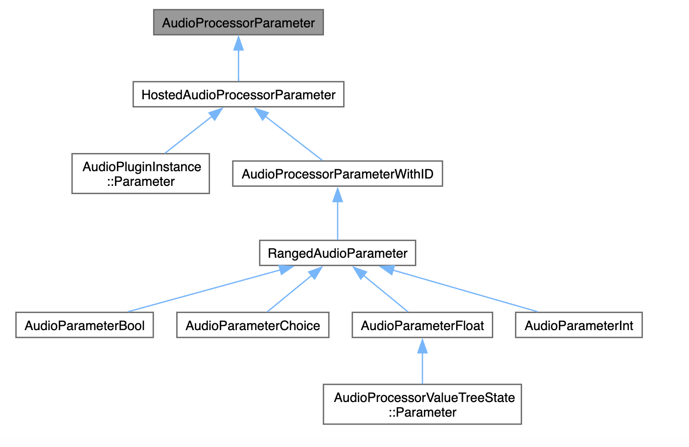

# SimpleEQ

## 개발 환경
OS: macOS
IDE: Xcode

\* 참고: [freeCodeCamp](https://youtu.be/i_Iq4_Kd7Rc?si=ZgJYunOA4IbsXTyL)

## 발견한 점

### `juce::ParameterID` 관련

- Logic Pro와 GarageBand는 파라미터 ID 대신 인덱스를 사용하여 파라미터를 관리하기 때문에 파라미터를 추가하거나 삭제하면 자동화 데이터가 손상될 수 있음
- 파라미터 추가 시 version hint를 사용하여 새로운 파라미터들이 항상 이전 파라미터들보다 높은 버전 힌트를 가지도록 설정해야 함
- 파라미터를 삭제하는 것은 위험하며, 특히 Logic Pro와 GarageBand와 같은 DAW에서는 파라미터 삭제로 인해 자동화가 깨질 수 있으므로 가능한 한 피해야 함
- 코드 예시
```Cpp
juce::AudioParameterFloat("Param1", "Param1", 1.f, 1.f);    // Deprecated
juce::AudioParameterFloat(juce::ParameterID("Param1", 1), "Param1", 1.f, 1.f);    // Deprecated
```
